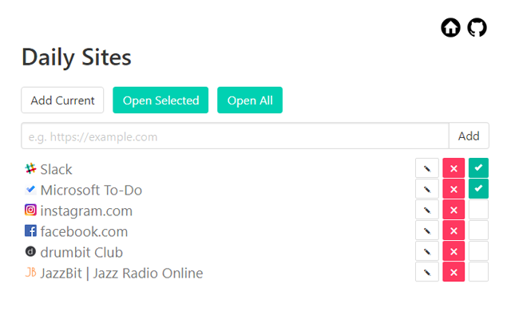

# Daily Sites Chrome & Firefox Extension
Daily Sites provides a convenient way to group daily-use sites into a list allowing you to open them all with just one click.

## Installing

### From source

#### Chrome
1. Open the Extension Management page by navigating to chrome://extensions.
2. Enable Developer Mode by clicking the toggle switch next to Developer mode.
3. Click the LOAD UNPACKED button and select the extension directory.

#### Firefox
1. Enter "about:debugging" in the URL bar.
2. Click "Load Temporary Add-on".
3. Open the extension's directory and select any file inside the extension.

### From Store

## Credits

User Interface design uses [bulma](http://bulma.io/), (C) 2018 Jeremy Thomas, [MIT](http://opensource.org/licenses/MIT)
